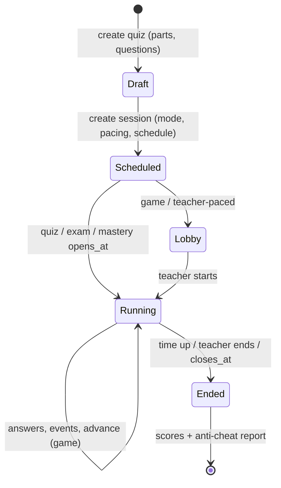
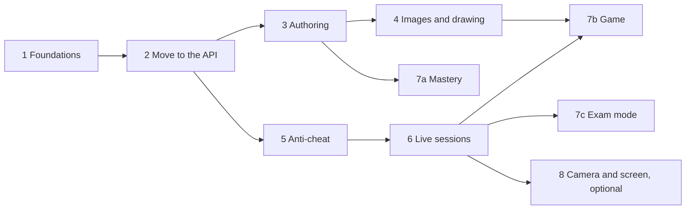

# Quiz system plan

Most of the quiz system already exists in the web app, but it runs on in-memory demo data (`apps/web/src/lib/data/mock.ts`). Live sessions need state that the teacher and every student share on a server, so quizzes move into the API (`apps/rpc`), and the new features are built there.

## 1. Current state

| Area | Today | Gap |
|---|---|---|
| Quiz model | `Assessment` in `apps/web/src/lib/types.ts`, kept in memory | No database tables or API calls for quizzes; no separate "session" |
| Question types | multiple choice, true/false, identification, fill in the blank, enumeration, numeric, essay, code, SQL | No matching type or cloze test; identification and fill in the blank are separate types |
| Parts | Each question type prints as its own part (`PaperSettings.parts`) | The teacher can't set parts |
| Randomizing | `studentOrder()` in `components/online-exam.tsx` uses `Math.random` | Order changes on reload; only multiple-choice choices are shuffled |
| Rich text | KaTeX only | No markdown |
| Anti-cheat | `IntegrityEvent { type, at }`, listeners in `exam-integrity.tsx`, one `blockCopyPaste` switch | No time away recorded, so no minutes; no live view for the teacher; copy, paste and right-click can't be set separately |
| Live updates | None (the API only answers HTTP requests) | Needed for the teacher's live view and teacher-paced games |
| Code | `code` and `sql` types; the runner is called from the web app (`data/code-runner.ts`) | The runner should be called from the API |
| Images | None; questions and choices are text only (plus LaTeX) | No file storage, no image questions or choices, no drawing or photo answers |

## 2. Main decisions

1. **A quiz and a session are separate.** A quiz is the reusable content. A session is one run of it, with its own mode, pacing, schedule and anti-cheat settings. One quiz can have many sessions.
2. **One "blank" question type** replaces `identification` and `fill_in_the_blank` and adds cloze:
   - `identification`: one answer box after the prompt.
   - `inline`: blanks inside a sentence.
   - `cloze`: a passage with many blanks; each blank is typed, or picked from a dropdown or word bank.
   - Blanks are written as `{{answer|alt}}` instead of `[answer]`, because the old form clashes with markdown links. Existing demo data is converted.
3. **Markdown** uses `react-markdown`, `remark-gfm`, `remark-math`, `rehype-katex` (KaTeX is already installed) and `rehype-sanitize`. The editor is a plain text box with a toolbar and a preview tab. It covers prompts, choices, part instructions, essay answers and feedback.
4. **Live updates** use Effect RPC streams over a WebSocket, because the API already uses Effect RPC and this keeps everything typed. Live state is kept in memory on one server for now; Redis is added when there is more than one server.
   - This replaces the Socket.IO plan in the README.
   - The web app (Vercel) and the API are on different hosts, so the browser can't send its login cookie to the API. Instead, the web server gets a short-lived ticket from `live.ticket`, and the browser connects with it.
5. **The server shuffles questions, using a seed saved for each attempt.** The order stays the same after a reload, and the teacher sees exactly what each student saw.
6. **Images are stored in S3 (any S3-compatible service: AWS S3, Cloudflare R2, or MinIO locally).** The bucket is private.
   - **Uploads:** the browser uploads directly to S3 using a short-lived presigned POST issued by the API (`asset.createUpload`), so files don't pass through the web app or the API.
   - **Viewing:** images are shown through short-lived signed GET URLs, so question images can't be seen before the session opens and students' drawings stay private.
   - **Library and settings:** the API uses `@aws-sdk/client-s3` and `@aws-sdk/s3-presigned-post`, with the environment variables `S3_BUCKET`, `S3_REGION`, `S3_ENDPOINT`, `S3_ACCESS_KEY_ID` and `S3_SECRET_ACCESS_KEY`.
   - **Local development:** devenv adds a MinIO service.
7. **Effect v4 everywhere, no Zod.** All validation (contract schemas, API input, web forms, environment variables) uses Effect v4 `Schema`. Zod is removed from the repo.

## 3. Workflow

The server enforces the time limits. `closes_at` and each attempt's time limit are checked when answers are saved and submitted. A timed job ends sessions that run out of time, and unfinished attempts are submitted automatically.

## 4. Data model

File: `apps/rpc/src/database/schemas/quiz.ts`. Migration: `pnpm db:generate --name quiz` (`0001_quiz`).

| Table | Columns |
|---|---|
| `quizzes` | id, owner_id, title, description (markdown), subject_area, settings (jsonb: shuffle questions, choices, parts), timestamps |
| `quiz_parts` | id, quiz_id, position, title, instructions (markdown), shuffle_questions, pool_size |
| `questions` | id, part_id, position, type, prompt (markdown), points (numeric), game_points (`standard`/`double`/`none`), body (jsonb: type-specific data, including weights for each blank, pair or test case; checked against the contract schemas) |
| `quiz_sessions` | id, quiz_id, class_id, mode (`quiz`/`exam`/`mastery`/`game`), pacing (`teacher`/`student`), status (`scheduled`/`lobby`/`running`/`ended`), opens_at, closes_at, time_limit, question_time_limit, attempts_allowed, results_release, integrity (jsonb), join_code, room_password, ip_allowlist, late_join_minutes, current_question_index, question_started_at, started_at, ended_at |
| `attempts` | id, session_id, student_id, seed, device_id, pledge_accepted_at, started_at, submitted_at, status, score, points |
| `answers` | attempt_id, question_id, value (jsonb), correct, auto_score, manual_score, feedback, answered_at, time_ms, tries |
| `integrity_events` | attempt_id, type, at, duration_ms, detail (jsonb) |
| `answer_history` | attempt_id, question_id, value (jsonb), saved_at. Append-only: every save is kept (exam mode) |
| `grade_changes` | answer_id, changed_by, old_score, new_score, reason, at. Every score change after results are released (exam mode) |
| `incidents` | id, attempt_id, teacher_id, note, action (`warned`/`locked`/`device_switch_allowed`/`time_added`/`force_submitted`), at |
| `assets` | id, owner_id, purpose (`question`/`answer`), s3_key, mime, size_bytes, width, height, sha256, status (`pending`/`ready`), timestamps. Questions and choices reference assets by id; drawing answers reference them through `answers.value` |
| `code_results`, `typing_edits` | Each linked to one answer; carried over from the current `Submission` fields |

Only the tables the quiz system needs move off demo data. Classes are covered only as far as `class_id` and the student list for each session need.

## 5. Contract (`packages/contract`)

- Schemas for every question type, including the new `MatchingQuestion` (left items, right items, pairs, distractors), `BlankQuestion` and `DrawingQuestion`. A choice, matching item or prompt can carry an `imageId` and alt text.
- Two versions of each question: one for the teacher with the answers, and one for students without them.
- RPC groups, all requiring a signed-in user:
  - `quiz.*`: list, get, create, update, delete, duplicate, and import from the question bank.
  - `session.*`: create, start, advance, pause, add time, end, release results, view one student's work, warn, lock, and force-submit a student.
  - `attempt.*`: join, get my paper, save answer, submit, record integrity events, check in (heartbeat), my result.
  - `live.*`: ticket, a stream for the teacher (students' progress and alerts), and a stream for students (current question, timer, leaderboard, teacher messages).
  - `asset.*`:
    - `createUpload` returns a presigned POST with the allowed type and a size limit enforced by S3.
    - `confirm` checks that the file exists, reads its size and dimensions, and marks it ready.
    - `urls` returns signed GET URLs for a list of asset ids, and only for assets the user may see.
- New `NotFound` error.
- New permissions in `permissions.ts`: `assessment.delete`, `session` (create, host, read), `attempt` (update), `result.release`, `asset` (create, read).

## 6. Session modes

Four modes. **Quiz** is the everyday mode; **Exam** is the serious, high-stakes mode.

### Quiz (standard)
Today's timed, scheduled flow, moved to the database. The teacher picks every setting freely: attempts, results release and anti-cheat settings.

### Exam (serious mode)
For midterms, finals and other major exams. Everything below is on by default, and the anti-cheat settings marked "locked" can't be turned off for an exam session; the teacher can only add stricter settings.

- **Locked anti-cheat:**
  - Full screen required, and focus and app-switch tracking.
  - `blockRightClick`, `blockCopy`, `blockPaste`, `blockPrint` and `clearClipboardOnStart`.
  - One screen only, the watermark, one device per attempt, and the heartbeat.
  - Answers and the answer key stay on the server.
- **Strict defaults (the teacher can change them):**
  - Auto-submit after 3 chances.
  - Computers only (phones and tablets refused).
  - Late-join cutoff of 15 minutes.
  - Room password on.
  - One attempt.
  - Results released manually.
  - `allowPasteInCode` off.
- **Before starting:**
  - A device check that full screen, one-screen detection and the connection work, with a clear message if not.
  - The student confirms their name and student number.
  - The student accepts an honor pledge; the time of acceptance is saved.
  - The rules are shown and must be acknowledged.
- **During:**
  - No feedback, no correct answers, no score and no leaderboard.
  - A countdown always visible, and no pausing by the student.
  - Resuming after a crash or disconnect is allowed only on the same device within a grace period (default 5 minutes). Otherwise the teacher must approve a device switch in the live view.
  - Every answer save is kept in `answer_history`.
  - The teacher's live view is required: alerts pop up as they happen.
- **After submitting:**
  - The paper is locked and the student can't review it until results are released.
  - Retakes only if the teacher grants one to a named student, and the reason is recorded.
- **Records:**
  - Each student's paper version (from their seed) is shown on the results and the printout.
  - Every score change after release is logged in `grade_changes` with a reason.
  - Teacher actions and notes are kept in `incidents`.
  - An integrity report for each student (events, minutes, timeline, incidents, answer history) can be exported to PDF and Excel for academic integrity cases.
- **Class record:** the exam can be linked to the major-exam category automatically.
- **Not allowed:** game points, leaderboards, mastery re-queuing and hints. Drawing, essay and code questions are allowed.

### Mastery
Self-paced. Each answer gets feedback right away, and wrong answers come back later in the queue until they're answered correctly or the retry limit is reached. Results show which questions were mastered and how many tries each one took.

### Game
- **Points:** a correct answer earns `base × (1 − elapsed / limit / 2)`, plus a streak bonus, where `base` comes from the question's game points (Standard 1000, Double 2000, None 0). A wrong answer earns 0.
- **Teacher-paced (like Kahoot):** a lobby with a join code. The teacher starts the game and moves from question to question; a question closes when its timer runs out or everyone has answered. After each question, the class sees how the answers split and the leaderboard.
- **Student-paced (like Wayground):** each student works through the questions alone while a live leaderboard updates.
- **Allowed question types:** essays aren't allowed in games. Code is allowed only in student-paced games. Drawing questions are allowed only as "No points": the teacher shows the class's drawings in a gallery (names hidden or shown) instead of scoring them. This is checked when the session is created.

## 7. Question types

| Type | How it's graded |
|---|---|
| Multiple choice (single answer, or an option for several correct answers) | Exact match, or partial credit for each choice |
| Blank (identification, inline, cloze) | Each blank checked against its accepted answers, with case sensitivity and near-miss acceptance as today |
| Matching | Partial credit for each correct pair; the right-hand column can include extra wrong options |
| Essay | The teacher grades it with a rubric; answers are written in markdown |
| Drawing or image answer | The teacher grades it from 0 to the question's points with a rubric, like an essay. The student draws on a canvas, or uploads or takes a photo (e.g. handwritten solutions, diagrams, graphs) |
| Code or coding activity | Runner test cases, with partial credit as today. A coding activity is a part or quiz made of code questions, run in exam or mastery mode, with longer time limits and the Run button on sample tests |
| SQL, enumeration, numeric, true/false | Unchanged |

The runner call moves from `apps/web/src/lib/data/code-runner.ts` into the API.

### Points per question

- **Points value:** every question has a points value set by the teacher in the editor (default 1; whole or half points, e.g. 0.5, 1, 2, 5). It is shown on the question card and, optionally, to students next to each question ("2 pts").
- **Points split inside a question:** by default the points are shared equally among the question's parts: each blank, each matching pair, each enumeration item, each code test. The teacher can instead set a weight for each blank, pair or test case (e.g. a hidden test worth more than a sample test).
- **Partial credit switch:** each question can be set to "all or nothing" or "partial credit". Multiple choice with several correct answers, blank, matching, enumeration and code all support both.
- **Essay and manual grading:** the teacher grades from 0 to the question's points; rubric rows can carry their own points that add up to the total.
- **Totals:** each part and the whole quiz show their point totals live in the editor, and the printed paper shows points per part ("Part II – Matching (10 pts)").
- **Bulk setting:** set the points for every question in a part, or every question of one type, in one action.
- **Question pools:** every question in a pool must have the same points, so every student's paper has the same total. The editor enforces this.
- **Game points (separate from grading points):** each question in a game is set to **Standard** (1000 base), **Double** (2000) or **No points** (practice), as in Kahoot. The speed and streak formula in section 6 is applied to this base. The final grade still uses the question's grading points, so a game can count in the class record without the speed bonus.
- **Storage:** `questions.points` (numeric) and `questions.game_points` (`standard`/`double`/`none`); weights for each blank, pair or test case live in `body`. Automatic scores in `answers` are stored as the fraction correct (0–1) and multiplied by the question's points when totals are computed, so changing a question's points after the session recalculates everyone's score. Manual scores are stored in points and capped at the new value.

### Images in questions and choices

- **Where images can go:**
  - **Prompt:** one or more images, added with an "Insert image" button or by dragging a file into the editor. They are stored in markdown as ``, and the renderer swaps in signed URLs.
  - **Choices:** each multiple-choice option can be text, an image, or both. Image choices are shown as a grid.
  - **Matching:** items on either side can be images (e.g. match a picture to a term).
  - **Cloze and part instructions:** images inside the markdown work in the same way.
- **Limits:** PNG, JPEG, WebP and GIF, up to 5 MB each. The browser shrinks large images (longest side 2000 px) and removes location data (EXIF) before uploading.
- **Alt text** is required when saving; it is used by screen readers and on the printed paper if the image fails to load.
- **Printing:** the paper layout and print preview embed the images.
- **Reuse:** duplicating a quiz or importing from the question bank reuses the same asset ids, without copying files.
- **Cleanup:** a daily job deletes `pending` uploads older than 24 hours and assets that no question or answer references anymore.

### Drawing or image answer question type

- **Teacher sets:**
  - The prompt.
  - An optional background image for the student to draw on (e.g. "label this diagram", a blank graph or a map).
  - Whether students can draw, upload a photo, or both.
  - The canvas size, the rubric and the points.
- **Student gets:**
  - **Drawing tools:** pen, highlighter, eraser, a few colors and thicknesses, text labels, undo/redo and clear. Pen pressure is supported on tablets.
  - **Photo upload:** "Upload or take a photo" uses the phone's camera, so students can photograph work done on paper. Up to 3 images per answer.
- **Drawing tool:** a plain `<canvas>` with `perfect-freehand` for smooth strokes. It is light enough for phones, and there is no license cost.
- **What is saved:**
  - The strokes are saved as JSON in `answers.value`, together with the exported PNG asset id.
  - The strokes are autosaved like other answers, so a reload restores the drawing and the teacher can replay how it was drawn (like the code typing replay).
  - The PNG is uploaded on submit and, during the session, every 30 seconds for the live view.
- **Grading:** in Review answers, the teacher sees the image full size, with zoom. The teacher can draw marks over the answer (strokes saved separately in `answers.feedback`), and the student sees them with the result.
- **Anti-cheat:**
  - Uploading a photo stays allowed when `blockPaste` is on.
  - Pasting an image from the clipboard is blocked and logged as `paste`.
  - The teacher can set "Camera only" so students can't pick a file from their gallery.
  - Each upload's time is logged, and a photo uploaded long before the question was opened is flagged.

## 8. Parts and randomizing

- The teacher creates, names, reorders and deletes parts, each with markdown instructions. Questions can be dragged between parts.
- The printed paper uses these parts instead of grouping by question type, so `PaperSettings.parts` is removed.
- Shuffling is seeded from `attempt.seed`. It can shuffle question order within each part, the order of parts, multiple-choice choices, the matching right-hand column, and the cloze word bank.
- Question pools: a part can draw N of its M questions for each student.
- Answers are stored against the original question ID, so shuffling never affects scoring.

## 9. Anti-cheating

### 9.1 Already built (carried over)
Full screen with a set number of chances, a log of tab and app switches (Alt+Tab included), one screen only, blocked copy, paste, drag and printing, the clipboard cleared at the start, a watermark, a server-side timer, paste and robot-typing flags for code, code similarity checks and typing replay.

### 9.2 Separate copy, paste, right-click and print settings
The single `blockCopyPaste` switch is replaced with separate settings in `IntegritySettings`:

| Setting | What it blocks | Logged as |
|---|---|---|
| `blockRightClick` | The right-click menu, and long-press menus on phones | `right_click` |
| `blockCopy` | Copy and cut (including Ctrl/Cmd+C and X), and selecting question text | `copy` |
| `blockPaste` | Paste by any method, and dragging text in | `paste`, `drop` |
| `blockPrint` | Printing and saving the page | `print` |
| `clearClipboardOnStart` | Text already on the clipboard before the exam starts | – |
| `allowPasteInCode` | Exception: paste is allowed in the code editor; every paste is still logged and shown in the typing replay | `paste` |

- **Code changes:** `exam-integrity.tsx` checks each setting separately, and the `select-none` class in `online-exam.tsx` depends on `blockCopy`. The editor shows one switch per setting. The session summary and the student instructions list only the settings that are on.
- **Defaults:** exams turn everything on and lock it (section 6); quizzes and games turn everything off; mastery turns on `blockCopy` only.
- **Migration:** quizzes with `blockCopyPaste: true` get all four block settings and `clearClipboardOnStart` turned on.

### 9.3 Prevention (the server controls what students can see)

| Method | What it stops | How |
|---|---|---|
| Answers never sent to the browser | Reading answers from the page source or network traffic | Only the student version of each question is sent; scoring happens on the server |
| Question pools | Students sharing one paper | Each student gets a different set of questions, picked from their attempt's seed |
| One question at a time, no going back (optional) | Looking a question up and returning to it later | The server sends the next question only after the current one is answered |
| Time limit per question | Searching for answers | The server rejects answers after the deadline |
| Join code and late-join cutoff | Students outside the room joining | Students can't join after a set number of minutes |
| Room password (optional) | Students outside the room taking the exam | The teacher reads it out or shows it on the projector; it changes each session |
| IP allowlist (optional) | Taking a lab-only exam from home | The session accepts only the computer lab's network |
| One device per attempt | Logging in on a second device to look things up or get help | The attempt is locked to one browser; a second login is blocked and flagged |

### 9.4 Detection (logged with count and minutes)

| Event | What it catches | How |
|---|---|---|
| Time away (`duration_ms`) | Leaving the page or switching apps | Leave and return times are recorded |
| Disconnected | Turning off the internet to search | Regular check-ins to the server; the gap length is recorded |
| Time out of full screen | Leaving full screen for a long time | Exit and return times are recorded and added up as minutes |
| Device or network changed | Handing the exam to another person | The browser or network address changes during the attempt |
| Shared device or network | Two accounts on one computer | Flag only, because campus Wi-Fi gives many students the same address |
| Too-fast answers | Answers looked up or copied in advance | An answer under a set number of seconds, or far faster than the class average |
| Pasted or robot-typed text in essays and blanks | Pasting AI-written or copied text | The current code paste detection applied to every typed answer |
| Essay typing replay | Text typed out from another source | The current code typing replay applied to essays |
| Developer tools opened | Inspecting the page | Rough detection; logged but not acted on automatically |
| Split screen on phones | Two apps side by side | `window_resize` plus checks on screen orientation and size |

### 9.5 Checks after the session ends

| Check | What it catches |
|---|---|
| Matching wrong answers | Two students with the same rare wrong answers, which is a strong sign of copying |
| Essay and blank similarity | Extends `similarity.ts` from code to written answers |
| Submission timing clusters | Students who answer in the same order at the same times |
| Integrity summary | Combines all signals into one low/medium/high level per student; the teacher decides what to do, and nothing changes the score automatically |

### 9.6 Teacher actions during a session
Send a warning message to a student, pause or lock one student, give extra time, force-submit an attempt, and allow a student back in after a crash.

### 9.7 Optional camera and screen monitoring (off by default)
- **Camera snapshots:** a photo every N minutes, plus a check that someone is in front of the camera.
- **Whole-screen sharing:** Chrome and Edge can require the student to share their entire screen. Periodic screenshots go to the teacher; full video would be too heavy for 500 students.
- **Requirements:** student consent, a privacy notice under the Philippine Data Privacy Act, a retention period for the images, and storage. Built last, and only if the school wants it.

### 9.8 Not recommended
- **AI-writing detectors:** they wrongly flag honest students too often to be fair to use.
- **Lockdown-browser or virtual-machine detection:** a website can't reliably detect these.
- **Penalizing automatically from flags:** apart from the existing auto-submit setting, flags only alert the teacher.

### 9.9 Report
For each student, every event type shows its count and when each one happened. The report also shows total minutes away, minutes out of full screen and minutes disconnected, the longest single gap, a timeline, and the integrity level. It appears in the live view and in the results.

## 10. Live teacher view (`/teacher/sessions/[sessionId]`)

- A table of students: status, progress, current question, score so far, alert count, minutes away, integrity level.
- Opening a student shows their current answers (read-only, updated live), the code and essay typing replay, drawing thumbnails updated as they draw, and a timeline of anti-cheat events.
- Controls: start, advance, pause, add time, end, warn, lock, and force-submit one student.

## 11. After the session ends

- **Teacher:** each student's score and percentage, results by part, by question and by item, the anti-cheat report, final game standings, an Excel export, and the existing class-record link (`countInRecord`).
- **Student:** their score according to the results-release setting, their answers and feedback, their game rank, and their mastery breakdown.

## 12. Phases

Each phase ends in a working, releasable app: CI passes (lint, typecheck, migrations apply with nothing left ungenerated, seed, API start-up, web build), the README is updated for what changed, and the phase's exit checks pass. No phase leaves demo-data fallbacks or half-built screens behind.

Phases 3–4 and phase 5 can run at the same time. Mastery (7a) needs only phase 3; Game (7b) needs phases 4 and 6; Exam mode (7c) needs phase 6.

### Phase 1 – Foundations
**Goal:** the shared contract and database are in place.
- **Contract:**
  - Schemas for quizzes, parts, the current question types, sessions, attempts, answers and integrity events.
  - The teacher and student versions of each question.
  - The `NotFound` error.
  - The new permissions (`assessment.delete`, `session`, `attempt.update`, `result.release`).
- **Database:**
  - The tables `quizzes`, `quiz_parts`, `questions`, `quiz_sessions`, `attempts`, `answers`, `integrity_events`, `code_results` and `typing_edits`.
  - Migration `0001_quiz`.
  - The seed loads the current demo quizzes and submissions.

**Exit checks:**
- The migration applies on a fresh database.
- The seed loads every demo quiz.
- The contract schemas decode every seeded question.

### Phase 2 – Move to the API (quiz mode)
**Goal:** today's quiz and exam flow runs on the database as the standard Quiz mode, as one Create → Start → Run → End workflow. Existing exams keep their current settings until Exam mode arrives in phase 7c.
- **API handlers:** `quiz.*`, `session.*` (create, start, end, release results) and `attempt.*` (join, get my paper, save answer, submit, my result).
- **Scoring:** moved from `apps/web/src/lib/scoring.ts` to the API. The code-runner call moves from `data/code-runner.ts` into the API.
- **Time limits:** `closes_at` and the attempt time limit are enforced on the server. A timed job ends sessions and auto-submits unfinished attempts.
- **Web app:**
  - `data/teacher.ts` and `data/student.ts` call `callApi`.
  - The quiz, submission and attempt demo data is removed.
  - Sessions are listed under the quiz.
- **Results:** the screens in section 11 (score, by part, by question), reading from the API.

**Exit checks:**
- **End-to-end test:** a teacher creates a quiz and starts a session; two students take it, including a code question graded by the runner. The session ends on time, and the scores show for the teacher and, after release, for the students.
- **Restart:** the data survives a restart of the web server.

### Phase 3 – Quiz authoring
**Goal:** the full editor for questions, parts, points and randomizing.
- **Parts:**
  - Created, named, reordered and given markdown instructions, with questions dragged between them.
  - The printed paper follows the parts, and `PaperSettings.parts` is removed.
- **Points per question (section 7):** the points value, weights inside a question, all-or-nothing or partial credit, rubric points, live totals and bulk setting.
- **Markdown:** the renderer and the editor (toolbar and preview) for prompts, choices, instructions, essays and feedback.
- **Blank type:** identification, inline and cloze, with the `{{answer|alt}}` syntax and an "insert blank" button. It replaces `identification` and `fill_in_the_blank`, and existing questions are converted.
- **Matching type** with extra wrong options.
- **Randomizing:**
  - Shuffling is seeded from `attempt.seed`: questions within parts, the order of parts, choices, the matching column and the word bank.
  - Question pools, all at equal points.

**Exit checks:**
- **Scoring tests:**
  - Blank, cloze and matching.
  - Points split equally and with custom weights; all-or-nothing versus partial credit.
  - Totals recalculated after a question's points change.
- **Shuffle tests:** the same seed always gives the same order, pools and answer key.
- **End-to-end test:** a quiz with three parts, markdown and math, blank, cloze and matching questions, and shuffling on. Two students get different orders that stay the same after a reload, and both are scored correctly.

### Phase 4 – Images and drawing
**Goal:** images in questions, and drawing or photo answers.
- **S3 setup:**
  - The `assets` table and its migration.
  - The `asset.createUpload`, `asset.confirm` and `asset.urls` calls, and the `asset` permission.
  - The S3 environment variables, and MinIO in devenv.
- **Images in questions:**
  - Images in prompts, choices (shown as a grid), matching items and instructions.
  - Resizing and location-data removal in the browser.
  - Required alt text.
  - Images on the printed paper.
- **Drawing or image answer type:**
  - The canvas tools, with `perfect-freehand` for smooth strokes.
  - Background images.
  - Photo upload with the camera.
  - Autosave and stroke replay.
  - Teacher marks drawn over the answer, and a rubric for grading.
- **Cleanup:** the daily job deletes unused uploads.

**Exit checks:**
- **Upload tests:**
  - Wrong file types and files over 5 MB are rejected by S3.
  - A student can't get URLs for another student's drawing.
  - Question images aren't available before the session opens.
  - The cleanup job deletes only unused assets.
- **End-to-end test:** an image-choice question and a drawing question are answered from a laptop (drawing) and a phone (photo), then graded in Review answers.

### Phase 5 – Anti-cheat
**Goal:** everything in section 9 except the live teacher actions and the camera.
- **Settings:** the separate settings `blockRightClick`, `blockCopy`, `blockPaste`, `blockPrint`, `clearClipboardOnStart` and `allowPasteInCode`, with defaults by mode. Existing `blockCopyPaste` values are converted.
- **Prevention:**
  - One question at a time with no going back.
  - A time limit per question.
  - A join code, a late-join cutoff, a room password and an IP allowlist.
  - One device per attempt.
- **Detection:**
  - Leave/return durations, disconnects (heartbeat), and time out of full screen.
  - Device or network changes.
  - Too-fast answers.
  - Paste and robot-typing flags and typing replay for essays and blanks.
  - Developer tools and split screen.
- **After the session:** matching wrong answers, essay and blank similarity, timing clusters and the integrity summary.
- **Report:** the counts, minutes and timeline described in section 9.9, shown in the results.

**Exit checks:**
- **Integrity tests:**
  - Time-away and disconnect durations add up correctly.
  - Each block setting works on its own.
  - A second device is refused.
- **End-to-end test:** a student who leaves the tab twice for about one minute shows 2 events and about 2 minutes. Copy, paste and right-click are blocked and logged only when their setting is on.

### Phase 6 – Live sessions
**Goal:** the teacher watches and controls a session as it runs.
- **Connection:**
  - WebSocket support on the API.
  - `live.ticket`.
  - The teacher and student streams. Live state is kept in memory, and the game's position is also saved to `quiz_sessions`.
- **Live teacher view (section 10):**
  - The student table.
  - Live answers, typing replay and drawing thumbnails.
  - Anti-cheat alerts as they happen.
- **Teacher actions:** pause, add time, warn, lock, force-submit, and let a student back in.

**Exit checks:**
- **End-to-end test:** the teacher sees a student's answer and a tab switch within 2 seconds. A warning reaches the student, and locking stops the student's input.
- **Restart:** a running session recovers after the API restarts.

### Phase 7a – Mastery mode
**Goal:** self-paced practice until each question is mastered.
- **Flow:** feedback right after each answer, wrong answers put back in the queue, a retry limit and an optional target score.
- **Results:** which questions were mastered and how many tries each took.

**Exit checks:**
- **Mastery tests:** a wrong answer comes back later; the retry limit is respected; a reload keeps the queue.
- **End-to-end test:** a student finishes a mastery session, and the breakdown matches their tries.

### Phase 7b – Game mode
**Goal:** live games like Kahoot and Wayground.
- **Lobby:** a lobby with a join code.
- **Pacing:** teacher-paced (start, advance, the answer split after each question) and student-paced.
- **Points:**
  - Game points per question (Standard, Double, None).
  - Speed and streak scoring.
  - A live leaderboard and final standings.
- **Question types:** the allowed-type check. Drawing questions run as "No points" with a class gallery.

**Exit checks:**
- **Game point tests:** speed scaling, streaks, and Double and No points.
- **End-to-end test:** a teacher-paced game with three students, with the leaderboard order checked.
- **Load test:** a script connects 500 simulated players to one teacher-paced game. Each question reaches every player, and every player's answer is counted within the time limit.

### Phase 7c – Exam mode (serious)
**Goal:** the high-stakes exam mode in section 6.
- **Settings:** the locked anti-cheat settings and the strict defaults, enforced by the API (a request to turn off a locked setting is refused).
- **Before starting:** the device check, the identity confirmation, the honor pledge and acknowledging the rules.
- **During:** resuming on the same device within the grace period, and device switches approved by the teacher. Feedback and scores are hidden until release.
- **Records:**
  - The `answer_history`, `grade_changes` and `incidents` tables, with a migration from `pnpm db:generate --name exam_mode`.
  - The paper version shown on the results and the printout.
  - The integrity report exported to PDF and Excel.
- **Retakes:** granted only by the teacher, to a named student, with a reason.

**Exit checks:**
- **Locked settings:** the API refuses an exam session with any locked setting turned off.
- **Before starting:** a phone is refused when "Computers only" is on, and a student can't start without accepting the pledge.
- **Devices:** a student who reloads on the same device resumes; a second device waits for the teacher's approval.
- **Records:** every answer save appears in `answer_history`; a score changed after release is logged with its reason.
- **End-to-end test:** a full exam with two students, one of whom leaves full screen 3 times and is auto-submitted. The exported integrity report shows the events, minutes and incidents.

### Phase 8 – Camera and screen monitoring (optional)
**Goal:** the optional monitoring in section 9.7, started only once the school approves it.
- **Features:** camera snapshots with a check that someone is in front of the camera, and whole-screen sharing with periodic screenshots.
- **Privacy:** a consent screen, a privacy notice, a retention period and storage in S3.

**Exit checks:**
- **Consent:** a student who declines consent can't start a session that requires monitoring.
- **Retention:** snapshots are deleted after the retention period.

## 13. Risks

- **Moving off demo data** affects every quiz screen at once. It is a full switch, with no fallback to demo data.
- **Live state in memory** means a teacher-paced game is lost if the API restarts. The game's position is also saved to `quiz_sessions`, so it can be picked up again.
- **The `{{ }}` blank syntax** means teachers learn a new way to write blanks. The editor has an "insert blank" button.
- **Browser-side blocks and detection** stop most students but not a determined one. The real protection is that answers stay on the server and every attempt is logged.
- **S3 costs and speed:** 500 students loading the same question images at once makes many requests. Images are resized before upload, and signed URLs are cached for the session so the browser cache works. A CDN in front of the bucket can be added later if needed.
- **Drawing on phones** is harder than on laptops or tablets. Photo upload is the fallback, and the teacher chooses which methods are allowed.
