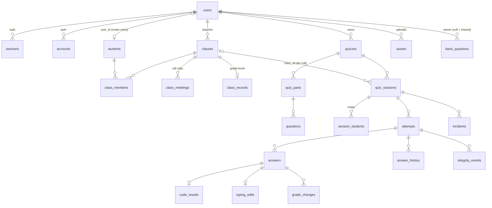

# Database schema, migrations and seed data

PostgreSQL 18 is the only persistent store, local or hosted (e.g. Neon, with `?sslmode=require`; use the direct, non-pooled URL for `db:migrate`). The API (`apps/rpc`) is its sole client, through Drizzle on Bun's built-in SQL driver (`Database.ts`). Schemas live in `apps/rpc/src/database/schemas/` (re-exported by `index.ts`); migrations in `apps/rpc/src/database/migrations/`.

## Conventions

- Plural snake_case tables and columns; repository style guide in `.claude/skills/drizzle/SKILL.md`.
- `_helpers.ts`: `timestamptz`, `createdAt`/`updatedAt` (`$onUpdate`), `timestamps` spread, and `newId(prefix)` → `"quiz-<uuid v7>"` ids (`Bun.randomUUIDv7()`) so a row's kind is visible and new rows sort by creation at the end of the index. Class, roster and guest-roster ids use the same helper (`c-…`, `s-…`).
- **Enums come from the contract.** `pgEnum`s are built from contract literals (`SessionMode.literals`, `questionTypes`, `integrityEventTypes`, `roleNames`, …), so adding a value in `packages/contract` changes the schema and needs a migration.
- **jsonb typed with contract types** (`$type<QuestionBody>()`, `IntegritySettings`, `ClassRecord["terms"]`, …). Answer values use the custom `jsonValue` type instead of Drizzle's `jsonb`, because Drizzle's `jsonb` re-parses strings and would turn a text answer like `"42"` into a number.
- **Scores:** `answers.auto_score` is a fraction 0..1, `answers.manual_score` is in points; totals multiply by the question's current points (see [Quizzes and questions](../concepts/quizzes-and-questions.md)).
- Asset references inside markdown/jsonb are plain ids, never foreign keys, so the daily cleanup can find unreferenced assets.

## Tables



### Auth (`auth.ts`)

Better Auth tables (`users`, `sessions`, `accounts`, `verifications`), plural via the Drizzle adapter's `usePlural`. Field names must match Better Auth's. `users` adds `role`, `banned*` (admin plugin), `is_anonymous` (anonymous plugin, for guests) and additional fields `department`, `student_id`, `plan`, `plan_expires_at`, `terms_accepted_at`. A `CHECK` constraint keeps each role to its own profile field (admins have neither department nor student id, teachers no student id, students no department, guests neither and must be anonymous). It compares `role::text`, because a migration that adds an enum value can't use it in the same transaction. Password hashes live in `accounts.password` for the `credential` provider; Google tokens (including Classroom scopes) live in `accounts` too. See [Authentication](../security/auth-and-permissions.md).

### Classes (`classes.ts`)

`classes` (unique `join_code`, `archived_at` soft archive, `classroom` jsonb link), `students` (roster entries; `user_id` unique and nullable, `student_number`/`sex` nullable for Classroom imports), `class_members` (composite PK), `class_meetings` (PK `(class_id, date)`; only exceptions in `records`), `class_records` (one jsonb grade book per class). See [Classes, attendance and the class record](../concepts/classes-attendance-and-class-record.md).

### Quizzes and sessions (`quiz.ts`)

| Table | Notes |
|---|---|
| `quizzes`, `quiz_parts`, `questions` | Content; `questions.body` jsonb holds the type-specific fields including answers. Cascade on delete. |
| `quiz_sessions` | One run of a quiz: `mode`, `pacing`, `status`, schedule, limits, `integrity`/`mastery`/`exam` jsonb, navigation, IP allowlist, room password, `allow_guests` (classless games only), `paused_at` (also the paused clock of a teacher-paced game question), game position (`game_phase`, `current_question_index`, `question_started_at`). `class_id` is `ON DELETE SET NULL`, so deleting a class keeps its sessions. A **partial unique index** makes `join_code` unique only among sessions whose status isn't `ended`, so keys can be reused later. |
| `session_students` | The roster snapshot (user ids); `removed_at` marks kicked players who stay listed but can't rejoin. |
| `attempts` | Unique `(session_id, student_id, attempt_number)`; random positive `seed`; device/IP binding; one-question-at-a-time position; `extra_ms`, `locked`, `pledge_accepted_at`; game `points`/`game_streak`; mastery `mastery_queue`. |
| `answers` | Unique `(attempt_id, question_id)`; value, `correct`, `auto_score`, `manual_score`, `feedback`, timings, `marked_for_review`, `shown_ms`, game and mastery fields. |
| `integrity_events` | Client- and server-detected events with optional duration. |
| `incidents` | Teacher actions (pause, warn, lock, …); `attempt_id` null = whole session. |
| `answer_history`, `grade_changes` | Exam mode, append-only: every answer save, and score changes after release with a reason. |
| `code_results`, `typing_edits` | One row per answer (PK = `answer_id`). |
| `bank_questions` | Whole question jsonb; null owner = shared bank. |

### Assets (`assets.ts`)

`assets` tracks S3 uploads: owner, `purpose`, unique `s3_key`, mime, size/dimensions/sha256 once confirmed, and `status` `pending` → `ready`, with an index on `(status, created_at)` for cleanup. See [Asset storage](../integrations/asset-storage.md).

## Migrations

`drizzle.config.ts` (PostgreSQL, `strict`, `verbose`) loads `apps/rpc/.env` itself because drizzle-kit runs under Node, which doesn't read `.env` automatically.

```bash
npm run db:generate -- --name <change>   # after editing a schema; commit the SQL and meta/
npm run db:check                          # migration consistency
npm run db:migrate                        # apply to DATABASE_URL
```

CI (`.github/workflows/ci.yml`) runs `db:check`, then `db:generate -- --name ci-drift-check` and fails if `apps/rpc/src/database/migrations` changed — i.e. a schema edit without a committed migration fails the build. It then migrates a fresh Postgres 18 and seeds it. The API container never migrates; production migration is an opt-in CI job (`MIGRATE_ON_DEPLOY`). See [Development and CI](../operations/development-and-ci.md).

Notable migration: `0011_guests.sql` adds the `guest` enum value, `users.is_anonymous`, `quiz_sessions.allow_guests` and rewrites the role CHECK.

## Seed and plan scripts

- `npm run db:seed` (`seed.ts`, Bun): idempotent (`onConflictDoNothing`). Creates test accounts (`admin@`, `teacher@`, `student@sic.edu.ph`, password `12341234`) and demo accounts (password `examora-demo`), writing Better Auth `credential` accounts with hashed passwords; an account for every demo roster student; demo classes, memberships, roll calls up to yesterday (`seed-classes.ts`) and class records; demo quizzes, sessions, attempts, answers, events, code results and typing edits (`seed-quizzes.ts`, `seed-data/demo-quizzes.json`); and the shared question bank (`seed-data/question-bank.json`). Session `mode` and answer `auto_score` are upserted so older seeded databases catch up.
- `npm run plan:set <email> <plan> [YYYY-MM-DD]` (`set-plan.ts`): sets a teacher's `plan` and `plan_expires_at` (end of that day; no date = no end). Only matches teacher accounts, case-insensitively.
