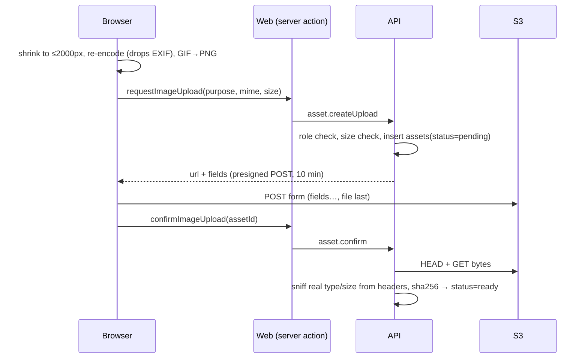

# Image and drawing storage (S3)

Images live in a **private** S3-compatible bucket (AWS S3, Cloudflare R2, Garage locally via devenv, MinIO). The API never proxies file bytes to browsers: browsers upload with a presigned POST and view with signed GET URLs. The `assets` table records ownership and verification state.

## Configuration

`Storage.ts` reads `S3_BUCKET`, `S3_REGION` (default `us-east-1`), `S3_ENDPOINT` (empty for AWS), `S3_ACCESS_KEY_ID`, `S3_SECRET_ACCESS_KEY` and optional `S3_PUBLIC_ENDPOINT`. Without bucket and credentials the API still starts; every storage call fails with `StorageUnavailable` ("Image storage isn't set up on this server.") and pages fall back to alt text.

- Path-style addressing is forced (Garage/MinIO compatibility).
- Two S3 clients when `S3_PUBLIC_ENDPOINT` differs from `S3_ENDPOINT`: the internal one for reads/deletes, the external one for anything handed to browsers, because signatures cover the host.
- The bucket's CORS must allow `POST` and `GET` from the web origin (devenv configures Garage).

## Asset ids and references

- Purposes: `question` (teacher images in prompts, choices, items, hotspot/drawing backgrounds) and `answer` (student drawings and photos).
- Allowed types: PNG, JPEG, WebP, GIF, up to 5 MB (`maxAssetBytes`).
- Markdown embeds images as ``; structured fields use `imageId`. `assetIdsIn(text)` finds ids by regex (`asset-<uuid>`) in any text or JSON, which is how "is referenced" is computed — there are **no foreign keys** to `assets`.
- Alt text is required: `imagesWithoutAlt` lists places the editor must fix before saving.

## Upload flow

- **`asset.createUpload`:** teachers may only upload `question` images and students only `answer` images (`Forbidden` otherwise). The key is `<purpose>/<userId>/<assetId>`. The presigned POST pins `Content-Type` and a `content-length-range` of 1 byte–5 MB, so S3 itself refuses other types or larger files.
- **`asset.confirm`:** owner-only. Reads the object (refusing anything over 5 MB), and `images.ts#imageInfo` parses PNG/GIF/WebP/JPEG headers to get the real type and dimensions. If the bytes aren't a valid image of the declared type, the object and row are deleted and the call fails with `Conflict`. Confirming twice returns the stored info.
- **Browser side** (`apps/web/src/lib/upload-image.ts`): `uploadImage` redraws onto a canvas (applying camera orientation) so only pixels survive — EXIF/location is stripped. `uploadPng` sends canvas exports from the drawing tool unchanged in size.

## Viewing: who may see what

`asset.urls` → `Assets.visible(user, ids)` returns only `ready` assets (max 300 ids per call) that the user may see, then signs 10-minute GET URLs:

| Viewer | Visible |
|---|---|
| Owner | Always their own assets. |
| Teacher | Question images appearing in their own quizzes (prompts, bodies, part instructions, descriptions) or in the shared/own question bank; answer images appearing in answers to their own quizzes' sessions. |
| Student | Question images in quizzes of sessions on their roster (not removed) whose derived status is `running` or `ended` — so students can't see a quiz's images before it opens. |
| Admin | Only their own. |

For a student's paper and result, `Assets.paperUrls` signs question images plus the student's own answer images directly, and returns `{}` when storage is down rather than failing the page.

`useAssetUrls` (web) refreshes every known URL every 8 minutes so a long exam never loses its pictures, and fetches URLs for ids it doesn't have yet (e.g. a just-uploaded image).

## Drawing answers

A drawing answer is JSON text in `answers.value` holding strokes, an exported picture `assetId`, and up to three photo ids (`packages/contract/src/drawing.ts`). On submit, `Quizzes.keepOwnPictures` drops any picture id that isn't a `ready` `answer` asset owned by that student, so a student can't attach someone else's upload. Teacher marks over a drawing are stored as JSON in `answers.feedback`.

## Cleanup

`Assets.cleanup` runs daily (`AssetCleanup` layer in `main.ts`). For assets older than one day it deletes:

- uploads still `pending` (never confirmed), and
- `ready` assets whose id appears in no quiz content, bank question or answer value.

S3 objects are deleted first, one request per object in batches of 20 (some S3 clones reject `DeleteObjects`' checksum header); if that fails the rows stay and the next run retries. The one-day grace keeps images an editor uploaded but hasn't saved yet. Duplicated quizzes share asset ids, so an image stays as long as any quiz references it.
