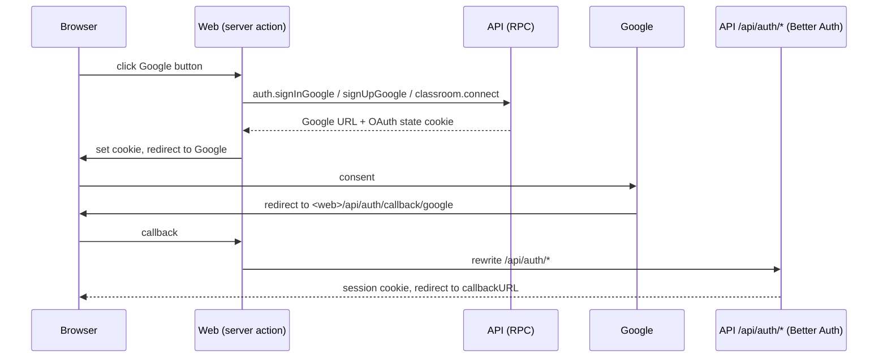

# Google sign-in and Classroom import

Both features need one Google Cloud OAuth client (`GOOGLE_CLIENT_ID` + `GOOGLE_CLIENT_SECRET` in `apps/rpc/.env`, both or neither — the API refuses to start with only one). Without them `auth.config` reports `google: false`, the buttons are disabled, and Classroom RPCs fail with `ClassroomUnavailable`. The redirect URI is `<BETTER_AUTH_URL>/api/auth/callback/google`; `BETTER_AUTH_URL` is the **web app's** origin, and the web app rewrites `/api/auth/*` to the API.

## OAuth round trip

The RPCs return Better Auth's state cookie with the URL because the browser never talks to the API directly; the web app sets it (`applyCookies`) before redirecting.

## Sign-in and sign-up (`AuthHandlers.ts`, `BetterAuth.ts`)

- `auth.signInGoogle`: signs in to an **existing** account only. Google is configured with `disableImplicitSignUp`, and email/password sign-up through Better Auth is disabled too.
- `auth.signUpGoogle` (from `/register`): passes `requestSignUp` and the chosen `RegistrationProfile` (teacher or student) as OAuth `additionalData`. A `user.create.before` database hook reads it back from the OAuth state, re-validates it (it's client-supplied), sets `role` and `termsAcceptedAt`, and rejects the creation if the profile is invalid.
- Account linking trusts Google and allows different emails, so a teacher can sign in with one address and link a school Google account for Classroom.
- Google redirect starts are rate-limited per IP (`limits.google`). See [Authentication](../security/auth-and-permissions.md).

## Connecting Classroom (`ClassroomHandlers.ts`)

`classroom.connect` (teachers, `class: create`) calls Better Auth `linkSocialAccount` with the three read-only scopes from `packages/contract/src/classroom.ts`:

- `classroom.courses.readonly`
- `classroom.rosters.readonly`
- `classroom.profile.emails`

plus `access_type=offline`, `prompt=consent`, `include_granted_scopes=true` so Google returns a refresh token. Tokens are stored by Better Auth in `accounts` (`provider_id = 'google'`). `classroom.status` reports `connected` when a linked Google account's `scope` contains all three scopes.

**Access tokens:** reused while valid for more than a minute; otherwise refreshed against `GOOGLE_TOKEN_URL` with the stored refresh token and written back to `accounts`. A failed refresh or a 401 from Classroom produces "Google access ended. Connect Google Classroom again." 403/404/other statuses map to specific `ClassroomUnavailable` messages. `CLASSROOM_API_URL` and `GOOGLE_TOKEN_URL` are overridable so tests can stand in for Google.

## Importing and syncing

- `classroom.courses`: all pages (100 per page) of the teacher's **ACTIVE** courses, each annotated with the Examinus `classId` if already imported.
- `classroom.import` (`class: create` + `roster: update`): for each course not already imported, creates a class with a fresh join code, `courseCode` = first word of the course name (Classroom has none), title/section/room truncated to column limits, and a `classroom` link `{ courseId, link, lastSyncedAt }`; then syncs its roster. Already-imported courses return their existing class id.
- `classroom.sync`: re-reads the course's students and **adds** newcomers; nobody is removed. Updates `lastSyncedAt`.

`syncRoster` per Classroom student:

1. Skip students without an email (nothing to match on).
2. Reuse any roster entry with the same email (case-insensitive), else create one with no account, no student number and no sex.
3. Insert the class membership; if new and the entry already has an account, add that student to the class's not-ended sessions.

Imported classes have no schedule, so attendance meetings don't appear until the teacher adds one.

## Claiming imported entries

When a student first uses enrollment features, `claimImported` in `ClassHandlers.ts` links an unowned roster entry with the same email **only if the account's email is verified** — true for Google sign-ins, false for email/password sign-ups. This prevents someone registering with a classmate's address from taking over their grades. After claiming, the student must still supply student number and sex on their next class join. See [Classes, attendance and the class record](../concepts/classes-attendance-and-class-record.md).

## Web side

`apps/web/src/app/teacher/classes/classroom-actions.ts`: `connectClassroomAction` sets the state cookie and redirects to Google (errors go back to `/teacher/classes?classroom=<message>`); `importClassroomAction` validates the selection and redirects to the new class (or list); `syncRosterAction` revalidates the class pages. Data calls live in `lib/data/classroom.ts`.

Google's Classroom scopes are "sensitive": a public launch needs Google's app verification (README).
