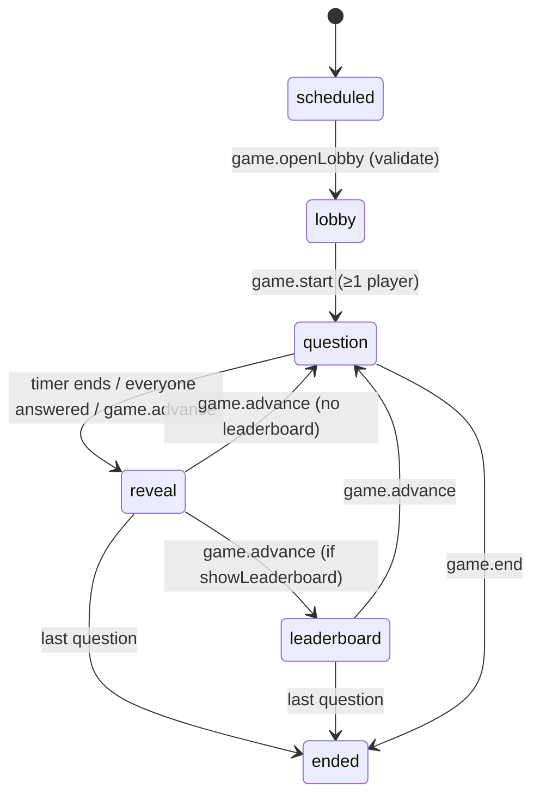

# Game mode

A session with `mode = "game"` is a live game. The server owns the clock and the points; browsers only render a `GameView` (`packages/contract/src/game.ts`) streamed to them. The engine is the `Game` service in `apps/rpc/src/modes/game.ts`; RPCs are in `GameHandlers.ts`.

| Pacing | Like | Flow |
|---|---|---|
| `teacher` | Kahoot | Teacher opens the lobby, starts, and advances the whole room: question → reveal → leaderboard (optional) → next… → podium. |
| `student` | Wayground | Each player presses Play and moves through their own paper with a per-question timer while a live leaderboard updates. |

## Settings and restrictions

`gameColumns` stores `pacing`, `game_question_seconds` (default 20, minimum `gameMinSeconds` = 5), `game_leaderboard`, `game_streak_bonus`, and forces: no time limit, one attempt, all questions on one page, free navigation, no marking. Only a game may be teacher-paced (`gameSettingsProblem`).

`gameQuestionProblems` (checked when opening the lobby and starting) refuses:

- quizzes with no questions;
- essay questions;
- code questions in a teacher-paced game (running code takes too long);
- drawing questions unless their game points are "No points" (shown as a gallery instead).

## Points (`gameAnswerPoints`)

- Base per question from `gamePoints`: standard 1000, double 2000, none 0 (separate from grading points).
- Correct answer: `base × (1 − elapsed / limit / 2)` — full points instantly, half at the last moment. Partial answers earn that fraction and **break** the streak.
- Streak bonus (if enabled): +100 per previous consecutive fully-correct answer, max +500.
- Wrong or unanswered: 0 and streak reset. "No points" questions leave the streak alone.
- Answers up to `gameGraceMs` (1.5 s) late still count at the slowest speed.

Game points (`attempts.points`, `answers.game_points_earned`) are separate from the grading score: when the game ends, every open attempt is submitted through `Quizzes.submit`, so normal results, grading and the class record still work.

## State: rooms over PostgreSQL

<!-- openwiki: mermaid parse failed and this diagram was converted to a text fence so it does not break rendering. Fix the diagram source and restore the mermaid fence. Parser error: Heuristic: an unescaped angle bracket inside a label breaks rendering; rephrase the label. -->
```text
flowchart LR
  DB[("quiz_sessions: game_phase,<br/>current_question_index, question_started_at<br/>attempts: points, game_streak, question_index<br/>answers: game_points_earned, time_ms")] -->|load on first touch / resume| Room["Room (in memory)<br/>players, tally, board, PubSub"]
  Room -->|persistPosition, answer rows| DB
  Room -->|GameView per viewer| Streams["live.game streams"]
```

- A `Room` is a cache rebuilt by `load` from the database the first time anything touches the session (and for all `lobby`/`running` games by `resume` at API start), so after a restart the same question continues with the time it had left.
- Teacher-paced games use **one paper for everyone**, seeded from a hash of the session id; student-paced players use their own attempt seed.
- Each room has a lock (semaphore) around phase changes and counts in-flight answers; `closeQuestion` and `finish` wait (up to ~2 s) for answers already on their way so none is left out of the split.
- Ended rooms' standings stay in memory for 30 minutes.

## Lifecycle (teacher-paced)



- `openQuestion` persists the position and publishes to all screens.
- `closeQuestion` (idempotent) marks non-answerers as missed, resets their streaks, recomputes the board and moves to `reveal`, where the presenter shows how answers split (`GameReveal` buckets per choice or Correct/Partly/Wrong) and the correct answer in words.
- `finish` sets session status `ended` and `game_phase = ended`, publishes the podium, then grades all open attempts in a detached fiber.

## Answers

`game.answer` checks the player joined, the game isn't over, the question is the open one (teacher-paced) or the player's current one (student-paced), and the time (+ grace). It **reserves** the answer before scoring so a double tap can't count twice. Scoring uses the contract's `autoScore` (code via the runner, SQL via the SQL grader). Answers are stored with `onConflictDoNothing`. In teacher-paced games the question closes as soon as every player has answered.

Student-paced: `game.next` moves a player forward only after the current question is answered; after the last one the attempt is submitted. The ticker times out players whose question ran past its limit.

## Ticker (every 500 ms, `Game.tick`)

- closes teacher-paced questions whose time is up;
- times out slow student-paced players;
- republishes the board (student-paced) or the presenter view when dirty;
- every ~10 s checks whether the session was ended elsewhere (e.g. the session page's End button) and drops rooms whose session was deleted.

## Joining and kicking

- `game.find(code)`: normalises the join key and finds a not-ended session. A **classless** session adds the student to its roster (they must already have a roster entry from joining some class; the late-join cutoff applies). A class session admits students already on its roster, or class members added after it was created. Removed students get "You were removed from this session."
- `game.join` creates the attempt (teacher-paced ones take the shared seed) in `lobby` or `running` (subject to late join), idempotently.
- `game.kick` (teacher): removes the player from the room, **deletes their attempt**, and sets `session_students.removed_at` so the key no longer works for them; may close the open question if everyone left has answered.

## Views and security

`viewFor(room, viewer)` builds a `GameView` per screen: the presenter gets lobby list, answer counts and reveal; a player gets only their own `me` (points, rank, streak, last result). A player never receives other players' answers or the correct answer before the question closes. Questions are sent as `StudentQuestion`s with signed image URLs (refreshed every 5 minutes) and SQL sample results.

Teacher RPCs (`openLobby`, `start`, `advance`, `end`, `kick`) require `session: host` and ownership via `LiveHub.ownsSession`, else `NotFound`. `game.standings` returns the full table to the owning teacher and marks the student's own row for students; `game.gallery` shows drawing answers to the teacher. Streams are served through `live.game` with a `game` ticket — see [Live sessions](./live-sessions.md).

Web side: `components/game-presenter.tsx` (projector screen at `.../sessions/<id>/present`), `game-player.tsx` (`/student/game/<id>`), server actions in `lib/game/actions.ts` → `lib/data/game.ts`, and a standings Excel export route.
