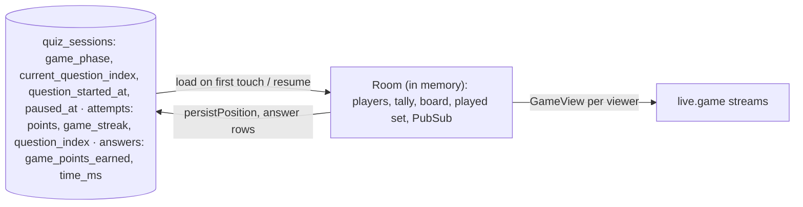
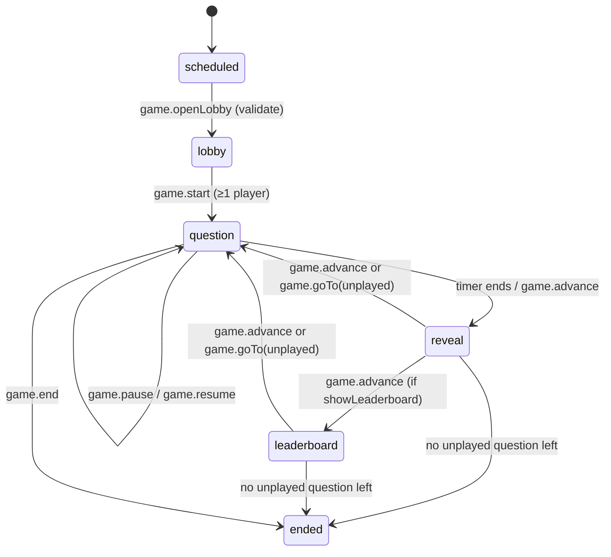

# Game mode

A session with `mode = "game"` is a live game. The server owns the clock and the points; browsers only render a `GameView` (`packages/contract/src/game.ts`) streamed to them. The engine is the `Game` service in `apps/rpc/src/modes/game.ts`; RPCs are in `GameHandlers.ts`.

| Pacing | Like | Flow |
|---|---|---|
| `teacher` | Kahoot | Teacher opens the lobby, starts, and advances the whole room: question → reveal → leaderboard (optional) → next… → podium. The teacher can pause the clock, change the seconds per question, and open any unplayed question instead of the next. |
| `student` | Wayground | Each player presses Play and moves through their own paper with a per-question timer while a live leaderboard updates. |

## Settings and restrictions

`gameColumns` stores `pacing`, `game_question_seconds` (default 20, `gameMinSeconds` 5 to `gameMaxSeconds` 300), `game_leaderboard`, `game_streak_bonus`, and forces: no time limit, one attempt, all questions on one page, free navigation, no marking. Only a game may be teacher-paced (`gameSettingsProblem`). `allow_guests` (only for games without a class) lets anyone with the key play as a guest.

Once the lobby is open, `session.update` may still change the clock, leaderboard, streak bonus, late join and similar fields; it then calls `Game.applySettings`, which loads them into the running room (a shorter clock closes an open question at once if its new length has passed).

`gameQuestionProblems` (checked when opening the lobby and starting) refuses:

- quizzes with no questions;
- essay questions;
- code questions in a teacher-paced game (running code takes too long);
- drawing questions unless their game points are "No points" (shown as a gallery instead).

## Points (`gameAnswerPoints`)

- Base per question from `gamePoints`: standard 1000, double 2000, none 0 (separate from grading points).
- Correct answer: `base × (1 − elapsed / limit / 2)` — full points instantly, half at the last moment. Partial answers earn that fraction and **break** the streak.
- Streak bonus (if enabled): +100 per previous consecutive fully-correct answer, max +500.
- Wrong or unanswered: 0 and streak reset. "No points" questions leave the streak alone.
- Answers up to `gameGraceMs` (1.5 s) late still count at the slowest speed.

Game points (`attempts.points`, `answers.game_points_earned`) are separate from the grading score: when the game ends, every open attempt is submitted through `Quizzes.submit`, so normal results, grading and the class record still work.

## State: rooms over PostgreSQL

- A `Room` is a cache rebuilt by `load` from the database the first time anything touches the session (and for all `lobby`/`running` games by `resume` at API start), so after a restart the same question continues with the time it had left.
- Teacher-paced games use **one paper for everyone**, seeded from a hash of the session id; student-paced players use their own attempt seed. The room tracks which question indexes were **played** (rebuilt on load from answered questions plus the one on screen) so a jump can't replay one.
- Each room has a lock (semaphore) around phase changes and counts in-flight answers; `closeQuestion` and `finish` wait (up to ~2 s) for answers already on their way so none is left out of the split.
- Ended rooms' standings stay in memory for 30 minutes.

## Lifecycle (teacher-paced)

- `openQuestion` marks the index played, clears any pause, persists the position and publishes to all screens.
- `closeQuestion` (idempotent) runs only when the clock runs out or the teacher advances — **answering early never closes it**, so nobody learns their result while others still have time. It marks non-answerers as missed, resets their streaks, recomputes the board and moves to `reveal`, where the presenter shows how answers split (`GameReveal` buckets per choice or Correct/Partly/Wrong) and the correct answer in words.
- `advance` picks the next question with `nextIndex`: the first unplayed index after the current one, else the first unplayed at all (jumps may skip some); none left → `finish`.
- `finish` sets session status `ended` and `game_phase = ended`, publishes the podium, then grades all open attempts in a detached fiber.

### Teacher clock controls (teacher-paced only, while running)

| RPC | Behaviour |
|---|---|
| `game.pause` | Only with a question open; stores `pausedAt` (persisted to `quiz_sessions.paused_at`). Answers are refused ("The game is paused.") and the ticker doesn't close the question. Views show `paused` and `pausedRemainingMs`. |
| `game.resume` | Moves `questionStartedAt` on by the paused time, so the question keeps the time it had left. |
| `game.goTo(index)` | Only between questions; opens any not-yet-played question. The presenter's `outline` lists every question (prompt first line with blanks hidden) and whether it was played; players get an empty outline. |
| `game.setSeconds(seconds)` | Stores the new length; an open question keeps its start and gets the new length, closing at once if already past. |

## Answers

`game.answer` checks the player joined, the game isn't over or paused, the question is the open one (teacher-paced) or the player's current one (student-paced), and the time (+ grace). It **reserves** the answer before scoring so a double tap can't count twice. Scoring uses the contract's `autoScore` (code via the runner, SQL via the SQL grader). Answers are stored with `onConflictDoNothing`. The player's screen then shows "Answer locked in"; in teacher-paced games the result, and the streak (views show the streak from before the open question), wait for the reveal.

Student-paced: `game.next` moves a player forward only after the current question is answered; after the last one the attempt is submitted. The ticker times out players whose question ran past its limit.

## Ticker (every 500 ms, `Game.tick`)

- closes teacher-paced questions whose time is up (not while paused);
- times out slow student-paced players;
- republishes the board (student-paced) or the presenter view when dirty;
- every ~10 s checks whether the session was ended elsewhere (e.g. the session page's End button) and drops rooms whose session was deleted.

## Joining and kicking

- `Game.lookup(code)` normalises the join key and finds a not-ended session (any mode); it also reports `guestsAllowed` (a game without a class with `allow_guests`).
- `Game.find(user, code)` builds on it. Guests are refused (`NotFound`) unless guests are allowed. A **classless** session adds the player to its roster (they must already have a roster entry — students from joining some class, guests get one from `auth.joinAsGuest`; the late-join cutoff applies). A class session admits students already on its roster, or class members added after it was created. Removed players get "You were removed from this session."
- `game.join` creates the attempt (teacher-paced ones take the shared seed) in `lobby` or `running` (subject to late join), idempotently.
- `game.kick` (teacher): removes the player from the room, **deletes their attempt**, and sets `session_students.removed_at` so the key no longer works for them.

### Guests

`auth.joinAsGuest { name, code }` (no auth middleware; rate-limited per IP with `limits.guestJoin`, 60 per 10 min) checks the key with `Game.lookup` **before** creating anything, so wrong keys make no accounts. A signed-in non-guest gets `Conflict`. A new visitor gets an anonymous Better Auth account (role `guest`) plus a `students` roster entry named as typed; a returning guest keeps their account and is renamed. Then `Game.find` puts them on the game's roster and the web app sends them to `/play/<session>` with the session cookies. See [Authentication](../security/auth-and-permissions.md).

## Views and security

`viewFor(room, viewer)` builds a `GameView` per screen: the presenter gets lobby list, answer counts and reveal; a player gets only their own `me` (points, rank, streak, last result). A player never receives other players' answers or the correct answer before the question closes. Questions are sent as `StudentQuestion`s with signed image URLs (refreshed every 5 minutes) and SQL sample results.

Teacher RPCs (`openLobby`, `start`, `advance`, `pause`, `resume`, `goTo`, `setSeconds`, `end`, `kick`) require `session: host` and ownership via `LiveHub.ownsSession`, else `NotFound`. `game.standings` returns the full table to the owning teacher and marks the player's own row; `game.gallery` shows drawing answers to the teacher. Streams are served through `live.game` with a `game` ticket, for students and guests on the roster — see [Live sessions](./live-sessions.md).

Web side: `components/game-presenter.tsx` (projector screen at `.../sessions/<id>/present`, with pause, seconds and jump controls), `game-player.tsx` (`/student/game/<id>` and the guest `/play/<id>`), server actions in `lib/game/actions.ts` → `lib/data/game.ts`, and a standings Excel export route.
