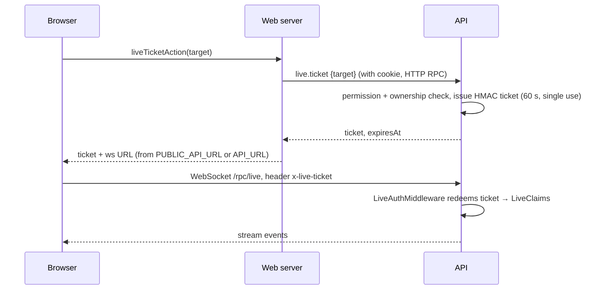

# Live sessions over WebSocket

The live view (`/teacher/assessments/<quiz>/sessions/<session>/live`), the student's exam page and games all receive pushes over one WebSocket endpoint, `/rpc/live`, served by the API with Effect RPC streaming (`LiveRpcs` in `packages/contract/src/live.ts`).

## Why tickets

The browser's login cookie belongs to the web app's origin and can't be sent to the API's host, so the WebSocket never authenticates with cookies:

- **Targets** (`TicketTarget`): `teacher` (sessionId), `student` (attemptId), `game` (sessionId).
- **Issuing** (`LiveTicketHandlers`): teachers need `session: host` and must own the session; students need their own **in-progress** attempt (else `Conflict`); game tickets go to the owning teacher (presenter) or a rostered student (player).
- **Format** (`LiveHub.issueTicket`): `base64url(JSON{jti, uid, role, target, exp}).HMAC-SHA256(BETTER_AUTH_SECRET)`. Rotating the secret invalidates tickets too.
- **Redeeming** (`redeemTicket`): constant-time MAC check, schema decode, expiry check, and a `jti` replay set kept in memory until expiry — a ticket works once.
- **Origin check:** `checkLiveOrigin` in `main.ts` rejects browser upgrades whose `Origin` isn't allowed (see [API server](../architecture/api-server.md#live-origin-check)).
- Each stream handler re-checks that the ticket's target and role match the requested stream (`Forbidden` "This ticket isn't for that.") and re-checks ownership.

## Client reconnects (`apps/web/src/lib/live/client.ts`)

Each (re)connect asks for a **fresh** ticket, so a dropped connection never reuses one. Backoff doubles from 1 s (capped, with ±25 % jitter). `Forbidden`/`NotFound` from the ticket or stream close the connection for good; status goes `connecting → live → reconnecting → closed`.

## Streams

| RPC | Viewer | Events |
|---|---|---|
| `live.teacher` | Owning teacher | First a `snapshot` (session, one `LiveStudent` row per rostered student, incidents), then `student` (row replaced), `answer` (as saved), `integrity` (events), `incident`, `session`. |
| `live.student` | The attempt's student | `state` (paused, locked, deadline, pausedAt, status) first and whenever they change, `warning`, `ended` (reason `teacher`, `session_ended`, `time_up`); the stream completes after `ended` or immediately if the attempt isn't in progress. |
| `live.game` | Presenter or player | Whole `GameView` per change; see [Game mode](./game-mode.md). |

A `LiveStudent` row carries status, last check-in, answered/marked counts, current question, provisional score (checkable answers only), alert count, minutes away, integrity level (`eventsLevel`), lock state and extra seconds.

## LiveHub: memory over PostgreSQL

`apps/rpc/src/Live.ts`. Everything a stream shows is **rebuilt from the database** when it connects — pause (`quiz_sessions.paused_at`), locks and extra time (`attempts.locked`, `extra_ms`), answers, events, incidents — so a restarted API or a reconnecting browser sees the same state. Only deltas between reads live in memory:

- Per session, two unbounded `PubSub`s (teacher and student). Subscriptions are made **before** the snapshot is read so nothing in between is lost.
- `attemptChanged(attemptId, change)` reloads that attempt, publishes its new row plus any answer/events; `state` changes tell the student stream to `resync` (re-read state); `ended` closes it. It is forked and never fails or delays the request that caused it.
- `seen(attemptId)` (heartbeats) refreshes the teacher's row at most every 10 s per attempt.
- `sessionChanged(sessionId)` republishes a full snapshot and tells all students to resync.
- Quiz details are cached for 30 s.

Because buses, ticket replay sets and game rooms are per process, **one API instance** is assumed; the README plans Redis for more.

## Teacher controls (`session.*`, `SessionHandlers.ts`)

All need `session: host` and ownership; each is recorded via `LiveHub.record` into `incidents` (shown in the timeline and integrity report).

| RPC | Effect |
|---|---|
| `session.pause` | Requires running; sets `paused_at`. While paused nobody can save (`requireWritable`) and the sweep neither ends the session nor expires attempts. |
| `session.resume` | `shiftClocks` by the paused duration: moves `closes_at`, adds `extra_ms` to attempts whose own time limit ends them first, and shifts each student's current question start; clears `paused_at`. Incident stores the pause length. |
| `session.addTime` | For everyone: `shiftClocks` without moving question starts. For one attempt: `extra_ms += seconds`. |
| `session.warn` | Pushes a `warning` to the student stream. |
| `session.setLocked` | `attempts.locked`; locked attempts can't save or submit until unlocked. |
| `session.forceSubmit` | `Quizzes.submit({ auto: true, reason: "teacher" })`; the student gets `ended`. |
| `session.allowBackIn` | Frees the attempt from its browser (`device_id`, `ip` cleared); see [Exam mode](./exam-mode-and-integrity.md). |
| `session.grantRetake` | Exam-only extra attempt with a reason. |
| `session.liveAttempt` | One attempt's details and incidents for the drawer (answers, typing replay, timeline). |

Web wrappers live in `apps/web/src/lib/data/live.ts` (each re-checks the role) and are exposed to the browser through `lib/live/actions.ts`.
