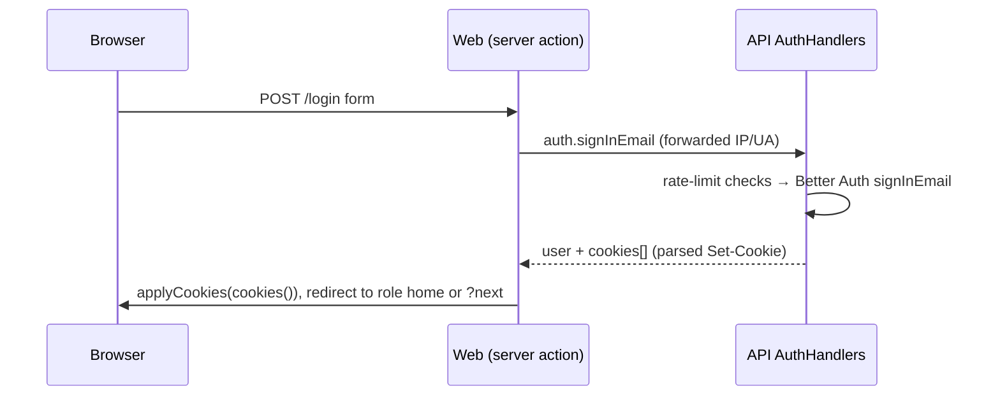

# Authentication, roles, permissions and rate limiting

## Where auth lives

Better Auth runs **inside the API** (`apps/rpc/src/BetterAuth.ts`) on the Drizzle adapter (plural Better Auth tables, see [Database](../data/database-schema.md)). The browser never talks to the API for auth, except the Google OAuth callback that the web app rewrites from `/api/auth/*`. `BETTER_AUTH_URL` is therefore the **web app's** origin.

Configuration highlights:

- Email/password enabled with Better Auth's own sign-up **disabled**; accounts come from admins, `auth.register`, Google sign-up, guest joins, or the seed script.
- Google provider (optional) with `disableImplicitSignUp`; account linking trusts Google with different emails allowed (see [Google Classroom](../integrations/google-classroom.md)).
- Admin plugin with the contract's access control (`ac`, `roles`), `adminRoles: ["admin"]`, `defaultRole: "student"`.
- Anonymous plugin (`emailDomainName: "guest.examora.invalid"`) for guests; the `user.create.before` hook gives any anonymous account the `guest` role. Guests never link a real account.
- Additional user fields `department`, `studentId`, `plan`, `planExpiresAt`, `termsAcceptedAt`, all `input: false` (clients can't set them).
- `BETTER_AUTH_SECRET` must be ≥ 32 characters; the API dies at start otherwise.

## Sign-in flow and cookies

- `cookiesFrom` (`BetterAuth.ts`) parses Better Auth's `Set-Cookie` headers into `ResponseCookie` objects that cross RPC; the web app sets them with `applyCookies`.
- Every later request forwards the browser's `cookie` header to the API (`forwardedHeaders`).
- `auth.session` also returns refreshed cookies when Better Auth extends a session; `proxy.ts` passes them on.
- The login action redirects only to `next` paths inside the user's own area, never another site.
- Failures map to contract errors: Better Auth `UNAUTHORIZED` → `InvalidCredentials`, `FORBIDDEN` (banned) → `AccountSuspended`, `TOO_MANY_REQUESTS` → `TooManyRequests`.
- `auth.register` checks the password rules (`passwordProblem`, shared with the `/register` checklist), rate-limits per IP, creates the user server-side via the admin plugin's `createUser` (no admin session is used, so no admin rights are exercised) with `termsAcceptedAt`, then signs in. Duplicate email → `Conflict`.

## Per-request authorisation in the API

- `AuthMiddlewareLive` (`Session.ts`) implements the contract's `AuthMiddleware` for every group except `auth.`: it calls Better Auth `getSession` with the forwarded headers and provides `CurrentUser`, or fails with `Unauthorized`. The session is read from the database on each request, so bans, removals and role changes apply immediately.
- `toSessionUser` builds the role-shaped `SessionUser`; a teacher's `plan` is the stored plan until `planExpiresAt`, then `free`; a guest carries only identity. An invalid role/profile combination is a defect.
- `requirePermission(perms)` fails with `Forbidden("Your role doesn't allow this.")` unless `can(role, perms)`. Handlers call it first, then scope by ownership (owner id, roster membership), returning `NotFound` for things the user may not see.
- WebSocket streams use ticket-based `LiveAuthMiddleware` instead; see [Live sessions](../modes/live-sessions.md).

## Roles and permissions (`packages/contract/src/permissions.ts`)

Statements extend Better Auth's admin `defaultStatements`. One source of truth is used by Better Auth's admin plugin, API handlers and the web app.

| Resource | admin | teacher | student | guest |
|---|---|---|---|---|
| `user` (create, list, get, update, set-role, set-email, set-password, ban, delete) | all | – | – | – |
| `session` | list, revoke, delete (login sessions) | create, host, read (quiz sessions) | – | – |
| `class` | – | read, create, update, delete | – | – |
| `roster`, `attendance`, `classRecord` | – | read, update | – | – |
| `assessment` | – | read, create, update, delete | – | – |
| `questionBank` | – | read | – | – |
| `submission` | – | read, grade | – | – |
| `result` | – | release | – | – |
| `enrollment` | – | – | read, create, delete | – |
| `attempt` | – | – | create, read, update | create, read, update |
| `asset` | – | create, read | create, read | create, read |

Admins have no teaching or exam-taking access and no impersonation. Guests have their own attempts and pictures and nothing about classes; handlers that only make sense for students check `role === "student"` explicitly (enrollment, attendance, class record), and `Game.find` only lets guests into games that allow them. Note the `session` statement is overloaded: Better Auth's login-session actions for admins plus quiz-session actions for teachers.

### Guests

`auth.joinAsGuest { name, code }` (no auth middleware): rate-limited per IP (`limits.guestJoin`); checks the key opens a game that allows guests (a game without a class with `allow_guests`) **before** creating anything; refuses signed-in non-guests with `Conflict`; otherwise reuses the guest's session (renaming them) or calls Better Auth `signInAnonymous`, names the account, creates a `students` roster entry, and returns the user, cookies and the game. `homeFor("guest")` is `/join`. Flow details: [Game mode](../modes/game-mode.md#guests).

## Web-side checks (`apps/web/src/lib/auth/dal.ts`)

- `proxy.ts` routes by role (anonymous → `/login?next=…`, wrong area → own home) on `/admin`, `/teacher`, `/student`, `/login`, `/register`. Routing only. `/join` and `/play` are outside its matcher.
- `readCurrentUser` (React `cache`, per request) calls `auth.session` and returns the user or null; `getCurrentUser` turns null into a redirect to `/login`.
- `requireAdmin` / `requireTeacher` / `requireStudent` redirect other roles home; `requireGuest` sends people without a session to `/join`; `requirePermission(perms)` uses the same `can`. Data modules call these before every API call; the API checks again regardless.

## Admin account management (`AdminHandlers.ts`)

`admin.*` RPCs check permissions, then call Better Auth's admin API **as the requesting admin** (forwarding their headers), so Better Auth re-checks too. Profiles clear other roles' fields. A roster entry (`studentId`) may belong to only one account (`Conflict` otherwise). Admins can't change their own role. Suspending bans the user, which signs them out everywhere.

## Plans (`plans.ts`, `roles.ts`)

Teacher plans `free`, `pro`, `ai` are stored on `users.plan` with optional `plan_expires_at`, set by `npm run plan:set` until payments exist. `plans.ts` describes them for `/pricing`; it is marked **DRAFT: Free limits aren't enforced yet**.

## Rate limiting (`apps/rpc/src/RateLimiter.ts`)

Done in the API because Better Auth's limiter skips the server-side calls the handlers make. Sliding windows of timestamps in an in-memory map per process (swept at most once a minute); `check` (no count), `count`, `hit` (check then count).

| Limit | Key | Max / window | Counts |
|---|---|---|---|
| `signInEmail` | lower-cased email | 10 / 15 min | wrong passwords only |
| `signInIp` | client IP | 200 / 10 min | wrong passwords only |
| `register` | client IP | 100 / 60 min | every sign-up |
| `google` | client IP | 300 / 10 min | every Google start |
| `joinCode` | student user id | 10 / 10 min | wrong class codes only |
| `guestJoin` | client IP | 60 / 10 min | every guest join attempt (each may create an account) |

Per-IP limits are wide because a whole class may share a campus IP. `clientIp` trusts the first `x-forwarded-for` entry, which is safe only because the API listens on loopback and the web host (Vercel) overwrites the header; a self-hosted web app needs a proxy that does the same. Multiple API instances would each count separately (Redis is the stated plan).

## Idle sign-out (`apps/web/src/components/session-watch.tsx`)

Signs the user out after 30 minutes without activity in **any** tab (shared through `localStorage`), with a "Still there?" warning a minute before; not while on an exam-taking page, which has its own timer. Every 2 minutes (and when a tab becomes visible) it checks the session is still valid and sends the page to sign-in if it ended elsewhere (expired, signed out, suspended); the login page explains why and returns the user afterwards.
