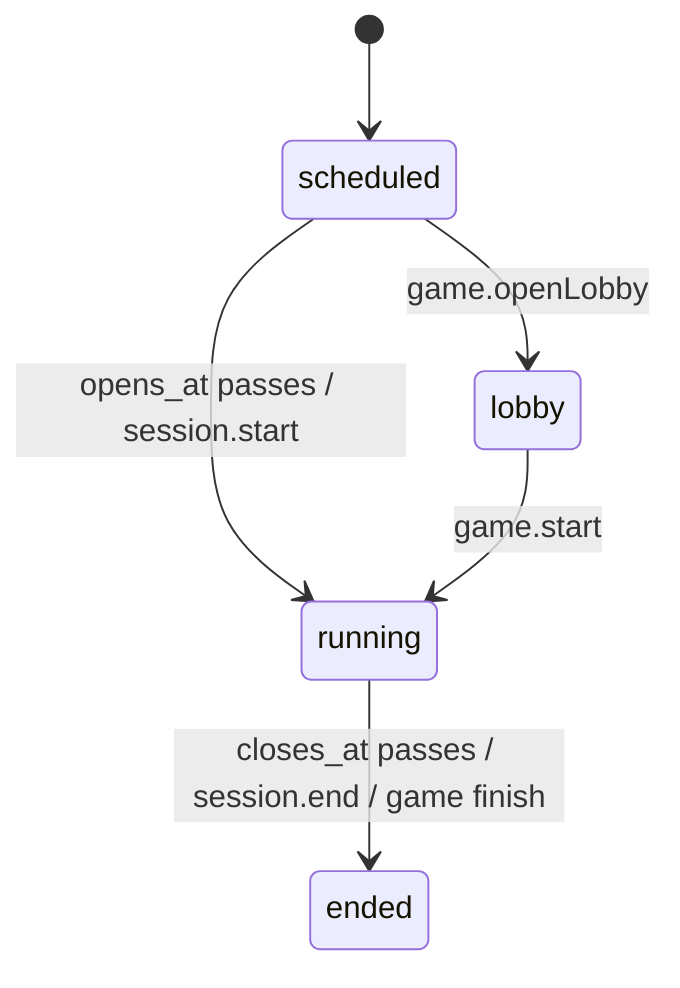

# Session and attempt lifecycle

A **session** runs a quiz in one mode (`quiz`, `exam`, `mastery`, `game`) with its own schedule and rules; an **attempt** is one student's go. Teacher side: `SessionRpcs` in `apps/rpc/src/handlers/SessionHandlers.ts`. Student side: `AttemptRpcs` in `AttemptHandlers.ts`. Shared logic: `apps/rpc/src/Quizzes.ts`. Mode-specific behaviour lives in [Exam mode](../modes/exam-mode-and-integrity.md), [Mastery](../modes/mastery-mode.md) and [Game](../modes/game-mode.md).

## 1. Creating a session (`session.create` / `session.update`)

Requires `session: create`, ownership of the quiz, and (optional) ownership of a non-archived class. `settingsColumns` validates everything before writing; violations are `Conflict`s with a human message:

- close after open; time limit ≥ 1 min; attempts ≥ 1 (null = unlimited);
- per-question time limit (≥ 5 s) and non-`free` navigation **require one question at a time**;
- `max_marked` 0–500 (0 = marking off, null = unlimited);
- mastery needs mastery settings; only games may be teacher-paced; exams can't turn locked anti-cheat settings off;
- late-join ≥ 1 min; room password ≤ 64 chars; every IP allowlist entry must be an address or CIDR range.

Defaults per mode come from the contract (`defaultIntegrity`, `defaultNavigation` = `marked_only` for exams else `free`, `defaultMaxMarked` = 5 for exams else unlimited, `examDefaults`).

**Join key:** `newJoinKey()` (7 chars, no look-alikes). Inserted with `onConflictDoNothing` against a partial unique index over not-ended sessions, retried up to 20 times on collision.

**Roster (`session_students`):** with a class, the class's current members **with accounts** are inserted (`syncRoster`); students who join the class later are added by `enrollment.join`. Moving a session to another class replaces the roster; editing the same class only adds. Without a class, the roster is whoever joins with the key (see `game.find`, which serves any mode).

**Start now vs schedule:** `startNow` makes non-game sessions `running` immediately; games open their lobby instead. `session.update` refuses ended sessions and games whose lobby is open.

## 2. Session status

Stored status only catches up when the sweep runs, so **every read derives it** with `sessionStatus(row, now)`: `ended` if stored ended or the clock reached `closes_at`; `running` if stored running or `opens_at` passed. While paused, the clock used is frozen at `paused_at`.

**Sweep (every 30 s, `Quizzes.sweep`):** flips due sessions to `running`, ends unpaused sessions past `closes_at` (with `ended_at = closes_at`), pushes live updates, and auto-submits in-progress attempts past their deadline + 60 s grace (or past the session end + their extra time + grace) with reason `time_up`.

`session.start` (not for games) opens a scheduled session now; `session.end` ends it immediately and auto-submits every in-progress attempt (`Quizzes.endSession`), or finishes a game through its room.

## 3. Starting and resuming an attempt

The student page first calls `attempt.paper` (intro: session, quiz meta, attempts used, size of the paper, whether the code runner exists). If no attempt is open, it refuses when the session isn't running or attempts are used up, and returns no questions.

`attempt.start { deviceId, roomPassword?, pledgeAccepted? }` — full checks in [Exam mode](../modes/exam-mode-and-integrity.md#starting-attemptstart). An open attempt is **resumed** (keeping its first `started_at`). A new one gets `attempt_number = previous + 1`, a random `seed`, the browser's `device_id` and IP.

`deviceId` is a random UUID in the `examora_device` cookie (`apps/web/src/lib/device.ts`) so the server can read it during render; every attempt call sends it. Clearing cookies mid-exam locks the student out of that attempt until the teacher allows them back in — by design.

## 4. The paper

`attempt.paper` with an open attempt returns the student's **seeded paper**: `attemptPaper(detail, seed)` → `orderForAttempt` (pools, shuffles), each question converted by `toStudentQuestion` (answers stripped; SQL questions get the expected sample result, never the answer query), saved answers and typing logs, deadline, review summary, pause/lock flags and signed image URLs. With **one question at a time**, only the current question (and its answer) leaves the server. Mastery sends no questions here.

## 5. While answering

| Call | Cadence (web `online-exam.tsx`) | Server behaviour |
|---|---|---|
| `attempt.saveAnswer` | debounced ~800 ms per question, retry after 5 s | `requireWritable` + `guard`; mastery refused; one-at-a-time only accepts the current, non-timed-out question (+3 s grace); answer cleaned and upserted with `time_spent_ms`; typing edits kept for code/SQL/essay/blank/enumeration; exam → `answer_history`; first answer under 2 s → `too_fast`; teacher live view updated. |
| `attempt.recordEvents` | flushed ~1 s after events | Integrity events (see exam page). |
| `attempt.heartbeat` | every 15 s | `guard` only: updates `last_seen_at`, logs disconnect gaps > 30 s and network changes. |
| `attempt.runSampleTests` | on Run (non-browser languages) | 6/min, visible tests only. |

**Writable** means: in progress, within the deadline (+60 s grace), session not paused, attempt not locked. Pauses and locks come from the teacher ([Live sessions](../modes/live-sessions.md)); the student page learns about them through the `live.student` stream.

### Deadlines

`attemptDeadline = min(started_at + time_limit, closes_at) + extra_ms`. `extra_ms` grows with per-student or whole-session added time and with pauses (on resume, attempts bound by their own limit get the paused duration).

### One question at a time, navigation and marks

- Position lives on the attempt: `question_index`, `furthest_index`, `question_started_at`. `questionProgress` advances it if a per-question limit ran out while the student was away (jumping back to the furthest question, or on to the next); the first read after that persists the move and marks those questions' time as used (`answers.shown_ms` = limit) so they stay closed.
- `attempt.goTo(index)` applies `moveRefusal` (`packages/contract/src/review.ts`):
  - closed (timed-out) questions never reopen;
  - `free`: anywhere;
  - `forward_only`: only the next question, once the current one is answered or timed out;
  - `marked_only`: forward the same way (a mark also lets them move on), back only to questions currently marked, and back to the furthest reached.
  Leaving a timed question adds the time spent to its `shown_ms`.
- `attempt.setMarked`: not in mastery or games; refused when `max_marked = 0`; one-at-a-time only on the current question; the limit is enforced under a `FOR UPDATE` lock on the attempt row so two concurrent marks can't both slip under it. A mark on an unanswered question creates an answer row with a null value.
- `attempt.paper` returns `review` items (answered, marked, closed, a short `answerSummary`) for the question overview and the pre-submit review screen.

## 6. Submitting

`attempt.submit { answers, events, typing }`: if still in progress, `requireWritable` and `guard` (without the IP allowlist — handing in is always allowed), then `Quizzes.submit` grades and flips the status once (race-safe) — see [Grading](./grading-and-results.md). Submitting twice returns the first result. The response includes the score only when results are visible.

Other ways an attempt ends: the browser's anti-cheat limit (auto-submit), the sweep (`time_up`), `session.forceSubmit` (`teacher`), `session.end` (`session_ended`), the last mastery answer, or a game finishing. Auto-submits add `auto_submitted` and a final `disconnected` gap; late manual submits add `late_submit`. The student stream receives `ended` with the reason.

## 7. Afterwards

- Retakes: allowed while attempts remain (`attempts_allowed`, plus exam `retake_granted` incidents); each retake is a new seed and paper.
- `attempt.result` / `attempt.myScores`: release rules in [Grading](./grading-and-results.md#when-students-see-results).
- `session.remove` deletes the session and cascades its roster, attempts and answers.
